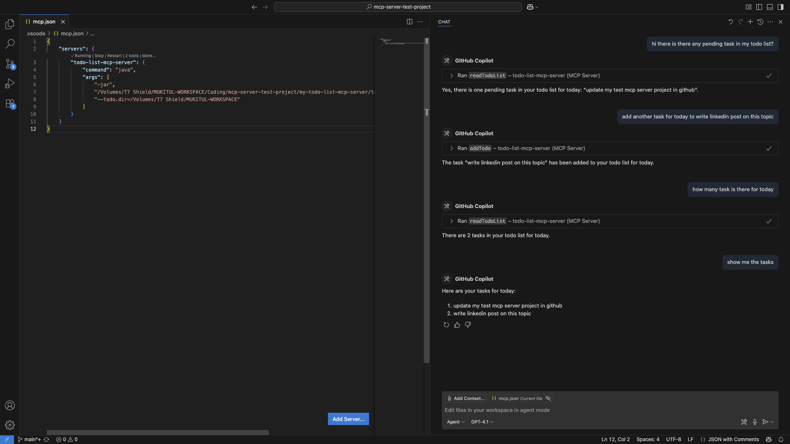

# MCP Server: TODO List Test Project

This is a **test MCP server** project created to explore the power and flexibility of building 
**custom tools for LLM-powered applications** using 
the [MCP (Model-Computer Protocol)](https://github.com/openai/magic) framework.

## What's In This Project?

This test server exposes two simple tools:

- `readTodoList` — Reads your current TODO list.
- `addTodo` — Adds a new task to your TODO list under a specific day.

These tools are backed by a local text file (`todo-list.txt`) that stores your tasks. 
You can even control where this file lives, making it easy to integrate into your daily workflows.

## Why Build an MCP Server?

LLMs like GPT-4o/Claude Sonnet 3.5 etc. are smart — but they become **even more powerful** when connected to external 
tools that can:

- Save data to your filesystem
- Run programs or commands
- Query external systems
- Do context-aware operations

That’s exactly what MCP allows you to do — **extend the AI’s capabilities by plugging in your own backend tools**.

This test project focuses on learning MCP by building something simple yet meaningful: a TODO list you can access via AI.

---

## How I Use This Project With VS Code Agent Mode

I use this server in **Visual Studio Code’s AI Agent Mode**, which connects to my MCP server and uses the tools 
automatically when prompted.

Here's how you can set it up too 👇
---

1. **Package this MCP Server**

   ```bash
   mvn clean package
   ```
   A jar will be created like this
   ```
   target/my-todo-list-mcp-server-0.0.1-SNAPSHOT.jar
   ```
   
2. **Choose your TODO List Storage Location**

   You can optionally pass a directory path where your todo-list.txt will be stored. If not provided, 
   it defaults to the directory where the JAR is run.

3. **Configure MCP Server in VS Code**

    - create a `.vscode/mcp.json` file in your vscode workspace
    - Select the Add Server button to add a template for a new server. Or, paste the below-mentioned JSON snippet.
    ```json
    {
        "servers": {
            "todo-list-mcp-server": {
                "command": "java",
                "args": [
                  "-jar",
                  "/absolute/path/to/my-todo-list-mcp-server-0.0.1-SNAPSHOT.jar",
                  "--todo.dir=/path/where/you/want/your/todo/file"
                ]
            }
        }
    }
    ```
    - After adding mcp server, some icons for Start this mcp server will be visible, click to start the mcp server,
      check logs, if mcp server started succesully or not.

4. **Chat With the Agent**
   
    Open the Agent chat panel and ask:

    ```
    - “What’s on my TODO list?”
    - “Add ‘Buy milk’ to Sunday’s TODO list.”
    ```
   
🎉 Your MCP server will respond and update the todo-list.txt behind the scenes!

## 🖼️ Visual Guide: VS Code Agent Setup

Here’s how the MCP server integrates with AI agent mode in VS Code with a GPT-4.1 model

